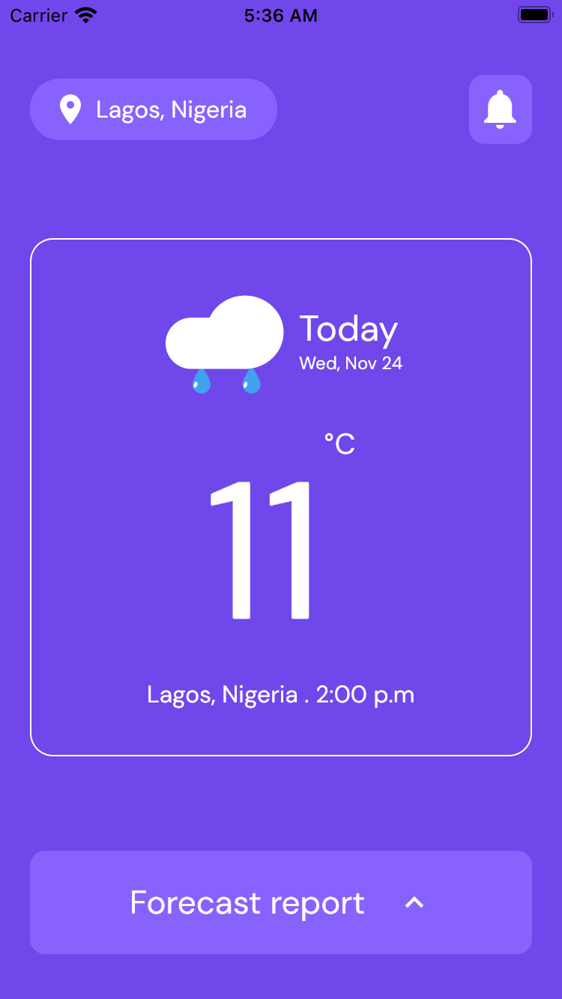
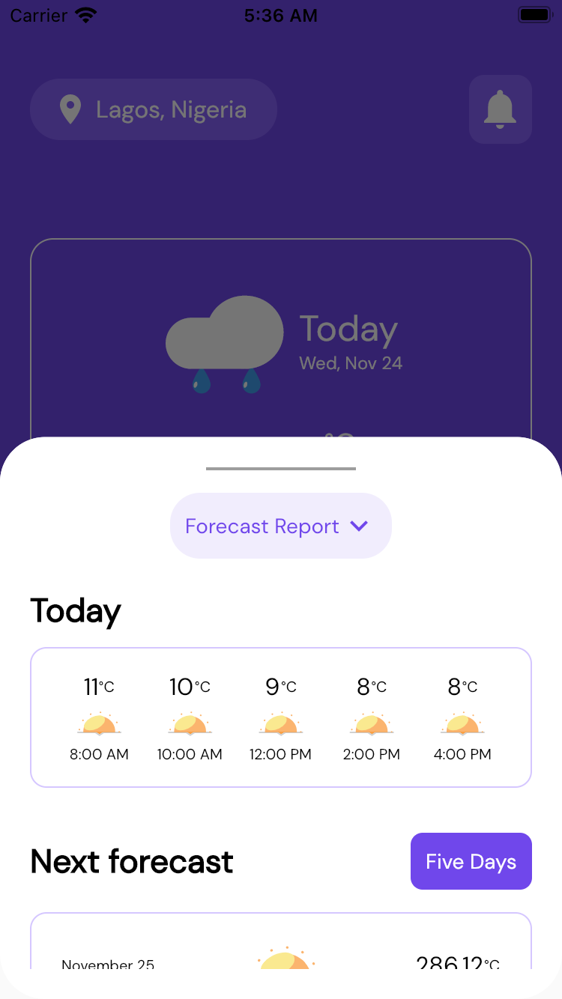
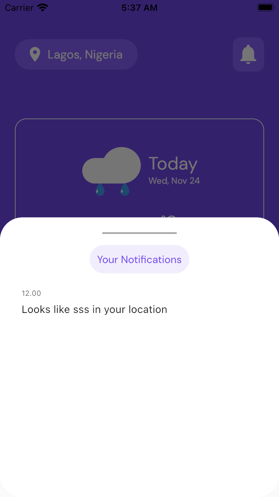

# retro_weather_app

A Simple Flutter Application project to get List of Tags and Products from shopify https://shopicruit.myshopify.com/admin/products.json Api.

## Features
* Get unique tags of each product
* Get products with their unique tags
* Get product with product id

## Screenshots
<h4 align="center">

  

